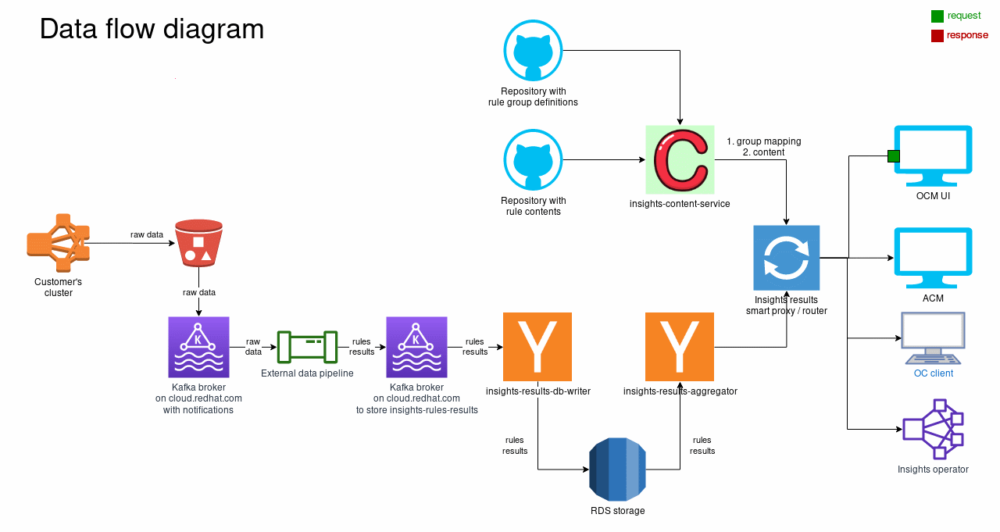

# Role of the service in the external data pipeline

The chosen architecture is architecture #3 ([architectures](./architecture/architectures.png)),
where the insights-content-service will now be called directly from
[insights-results-smart-proxy](https://redhatinsights.github.io/insights-results-smart-proxy/),
which will send complete information about the rules in one call.

